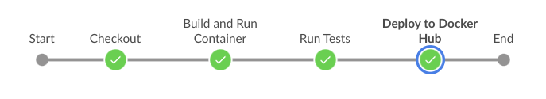

# Idea Blog

Welcome to the **IdeaBlog** repository! This project is a comprehensive example that demonstrates various aspects of modern web development, including Django-based application development, Docker containerization, Ansible automation, Jenkins CI/CD integration, and Kubernetes deployment.

## Table of Contents

- [Setup and Usage](#setup-and-usage)
  - [Local Development](#local-development)
  - [Dockerized Deployment](#dockerized-deployment)
  - [Kubernetes Deployment](#kubernetes-deployment)
- [CI/CD Jenkinsfile](#cicd-jenkinsfile)
- [Ansible Directory](#ansible-directory)
- [Nginx configuration](#nginx-configuration)
- [Environment Variables](#environment-variables)

## Setup and Usage

### Local Development

1. Begin by cloning this repository to your local machine.
2. Navigate to the root directory of the project.
3. Create a virtual environment: `python3 -m venv .venv` and activate it: `source .venv/bin/activate`.
4. Install dependencies: `pip install -r requirements.txt`.
5. Apply database migrations: `python manage.py migrate`.
6. Start the development server: `python manage.py runserver`.

### Dockerized Deployment

1. Make sure Docker is installed on your machine. (You can install Docker with ansible docker-playbook)
2. Build and Run: `docker-compose up -d --build`

### Kubernetes Deployment

1. Ensure you have a functioning Kubernetes cluster.
2. Deploy to Kubernetes: `kubectl apply -f k8s/`.

## CI/CD Jenkinsfile

The `Jenkinsfile` defines the CI/CD pipeline orchestrated by Jenkins (Dockerized Deployment). This pipeline encompasses the following stages:

1. **Checkout:** Fetch the latest code from the repository.
2. **Build and Run Containers:** Construct or pull Docker images and run those in containers.
3. **Run Tests:** Execute tests within the Docker container.
4. **Deploy to Docker Hub:** Push the Docker image to Docker Hub for distribution.

## Ansible Directory

The `ansible/` directory holds Ansible playbooks for automating tasks on the host machine. Specifically:

- The `docker-playbook.yml` playbook ensures Docker is installed on the host machine. Execute it using: `ansible-playbook ansible/docker-playbook.yml`.

- The `nginx-playbook.yml` playbook installs NGINX on the host machine if absent. Run the playbook using: `ansible-playbook ansible/nginx-playbook.yml`.

## Nginx configuration

The `nginx.conf` file serves as a customizable NGINX configuration template. Customize it to meet your specific requirements before copying it to `/etc/nginx/sites-available/` on your host machine.

## Environment Variables

For development environment, the `.env.dev` file is used to store environment-specific settings. Customize this file to define variables such as database configurations and secret keys that your Django application requires.

# Note

This project is intended for educational and practical purposes only. It serves as a learning exercise and does not have any commercial or production intent. The primary goal of this project is to provide hands-on experience and demonstrate various concepts, techniques, and skills in a real-world scenario.